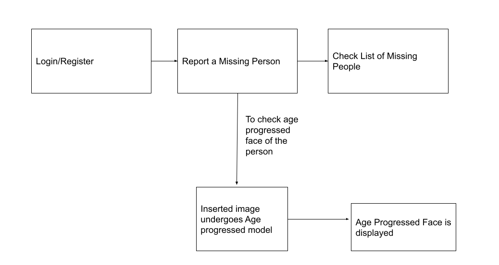

# Progressive Face Ageing
> The main  objective of this project is to generate age progressed faces using Generative Adversarial Network (GAN).The  model which we are going to develop is  based on face aging using Cycle GAN’s and SAM i.e Style-based Age Manipulation.With the help of our model one can  accurately predict the face structure of a person 10, 20 or 30 years from now ie how the person  will look in the later years of his life.

## Results From CycleGan and SAM
<pre>
 <b>Original Image              CycleGan                                     SAM </b>
</pre>

## Finding Missing People
> We also developed a Django based web application to show case how our model can be used in a real world application. This web application reports and keeps a track of missing people. It also shows how people will look after a certain years of age progression.

## Credits
**SAM model and implementation:**  
[https://github.com/yuval-alaluf/SAM](https://github.com/yuval-alaluf/SAM)
  
**CycleGAN and pix2pix in PyTorch:**  
[https://github.com/junyanz/pytorch-CycleGAN-and-pix2pix](https://github.com/junyanz/pytorch-CycleGAN-and-pix2pix)

## Acknowledgments
This code is inspired from [sam](https://github.com/yuval-alaluf/SAM) and [cyclegan](https://github.com/junyanz/pytorch-CycleGAN-and-pix2pix)
