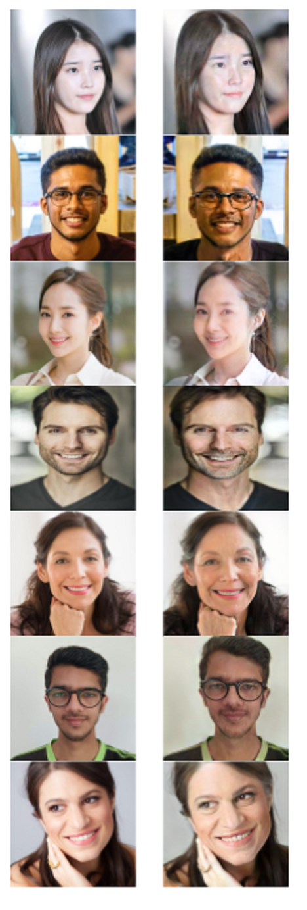

# Progressive Face Aging
> The main  objective of this project is to generate age progressed faces using Generative Adversarial Network (GAN).The  model which we are going to develop is  based on face aging using Cycle GAN’s and SAM i.e Style-based Age Manipulation.With the help of our model one can  accurately predict the face structure of a person 30 or 40 years from now ie how the person  will look in the later years of his life.

## Results From CycleGan and SAM
<pre>
 <b>Original Image                       CycleGan                                            SAM </b>
</pre>

